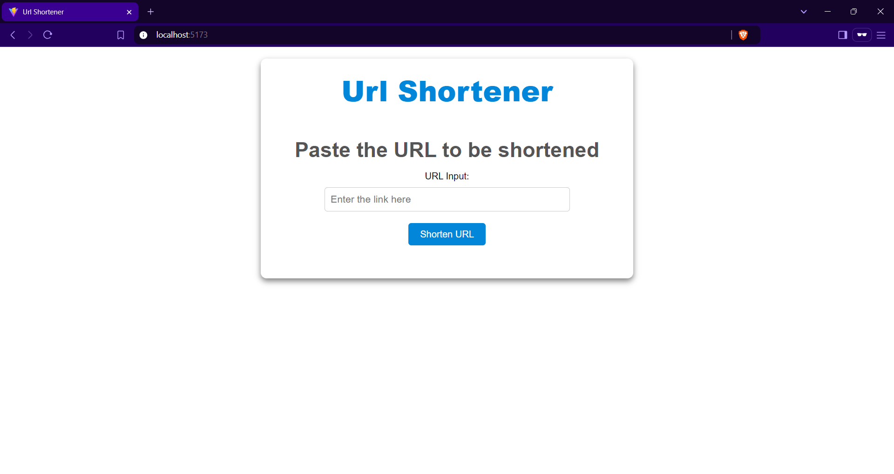
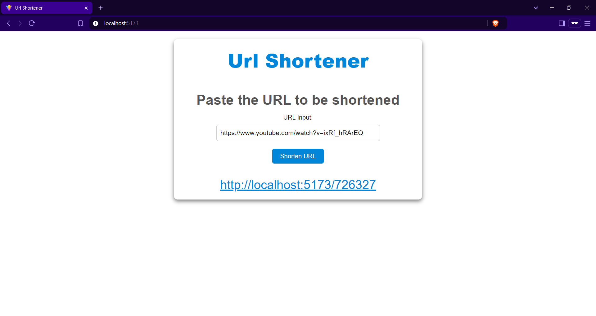
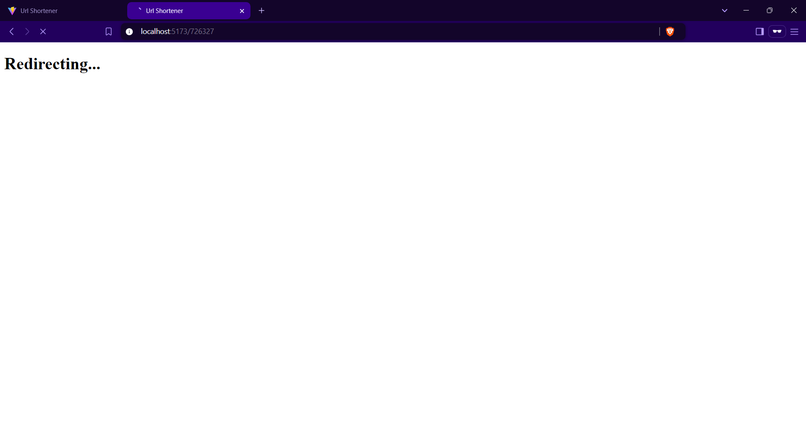
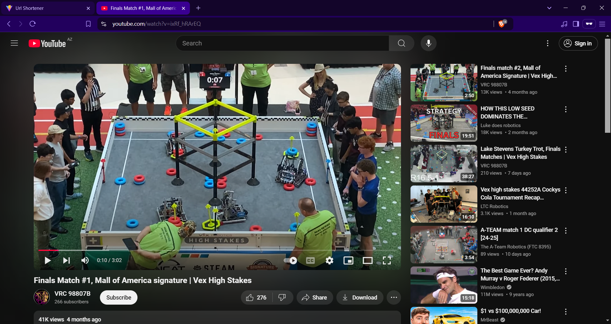

# 🌐 URL Shortener Project

Welcome to the **URL Shortener** project! 🚀 This simple yet powerful application allows you to shorten URLs effortlessly.

---

## 📸 Project Preview

  
  
  


---

## 📂 Project Structure

The project consists of two main folders:  

1. **backend** - Server-side code using Express.js and SQLite3.  
2. **client** - Frontend built with React.js.

---

## 🛠️ Technologies Used

### Backend (Server)
- **Framework**: [Express.js](https://expressjs.com/)
- **Database**: [SQLite3](https://www.sqlite.org/index.html)

### Frontend (Client)
- **Framework**: [React.js](https://reactjs.org/)

---

## ⚙️ Features

- Input any URL and get a shortened version instantly.  
- Simple, clean, and responsive user interface.

---

## 🚀 How to Run the Project

### 1. Clone the Repository
```bash
git clone https://github.com/abdullaabdullazade/url-shortener.git
```

### 2. Backend Setup
1. Navigate to the `backend` directory:
   ```bash
   cd backend
   ```
2. Install dependencies:
   ```bash
   npm install
   ```
3. Start the server:
   ```bash
   npm start
   ```

### 3. Frontend Setup
1. Navigate to the `client` directory:
   ```bash
   cd client
   ```
2. Install dependencies:
   ```bash
   npm install
   ```
3. Start the development server:
   ```bash
   npm start
   ```

---

## 📸 Demo
1. Open the frontend in your browser at `http://localhost:5173`.  
2. Enter a URL in the input field.  
3. Click the **Shorten** button.  
4. Receive your shortened URL! 🎉

---

## 📝 Notes

- Ensure the backend server is running before accessing the frontend.  
- The SQLite3 database will be automatically initialized when the backend starts.

---

## 🤝 Contributions

Feel free to fork the repository and contribute! Pull requests are always welcome.

---

Happy Coding! 💻

---

